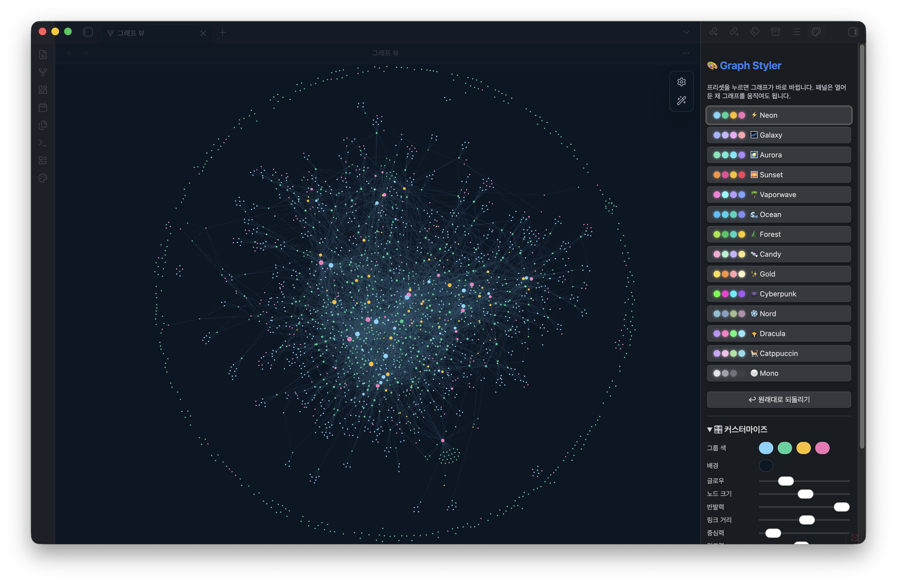

# 🎨 Graph Styler

옵시디언 그래프 뷰를 **클릭 한 번으로** 예쁘게. 무드 하나 고르면 **색·글로우**가 즉시 입혀지고 현재 그래프 물리는 그대로 유지됩니다. CSS나 JSON을 직접 만질 필요가 없어요.

만든 사람 **[Moonweave](https://www.instagram.com/phd.ai.log/)**.

<em>같은 vault, 클릭 한 번 차이 — Vaporwave &amp; Sunset:</em>

<table>
  <tr>
    <td width="50%"></td>
    <td width="50%"></td>
  </tr>
</table>

## 왜
옵시디언 그래프는 스크린샷이 정말 예쁘게 나오죠 — 근데 그렇게 만들려면 색 그룹, forces 슬라이더, CSS 스니펫을 다 뒤져야 합니다. Graph Styler는 그걸 클릭 한 번으로. *그래프계 Canva 템플릿*이라고 보면 됩니다.

## 프리셋
⚡ Neon · 🌌 Galaxy · 🌠 Aurora · 🌅 Sunset · 🌴 Vaporwave · 🌊 Ocean · 🌲 Forest · 🍬 Candy · ✨ Gold · 👾 Cyberpunk · ❄️ Nord · 🧛 Dracula · 🐈 Catppuccin · ⚪ Mono

기본 프리셋은 노드/그룹 색과 글로우만 적용하고 현재 그래프 물리·크기 설정은 유지합니다. 커스텀 프리셋은 forces·크기 값을 명시적으로 저장할 수 있습니다.

**내 프리셋 만들기.** 패널의 **🎛️ 커스터마이즈**를 열어 forces·크기 슬라이더(반발력, 링크 거리, 노드 크기…)를 끌고 색을 고르면 그래프가 라이브로 바뀝니다. 커스터마이즈는 그래프 물리도 바꾸므로, 다시 쓸 설정만 **💾 내 프리셋으로 저장**하세요.

## 색이 내 vault에 매핑되는 방식
Graph Styler는 하드코딩이 없습니다 — *내* vault에 맞춰 적응합니다:

- 노트가 많은 **폴더**를 찾아 프리셋 색을 입힙니다(최대 4개).
- 폴더가 없으면 많이 쓴 **태그**로 대체합니다.
- 폴더도 태그도 없는 완전 평면 vault면 → 글로우·배경·노드색은 그대로 적용되고, 그룹별 색 구분만 없습니다.

이건 옵시디언의 **네이티브 그래프 색 그룹**(설정 → 그래프 → Groups)에 기록되므로 거기서 보고 수정할 수 있습니다. 그룹이 2개든 4개든 알아서 동작하고, 글로우·배경·노드 스타일은 누구에게나 동일합니다. 프리셋을 적용하면 현재 색 그룹을 교체합니다 — 원본은 백업되니 **되돌리기**로 원복할 수 있습니다. 되돌리기는 Graph Styler가 처음 변경하기 전의 스냅샷으로 돌아가며, 이후의 그래프 설정 변경을 덮어쓸 수 있어 확인이 필요합니다.

## 사용법
1. 그래프 뷰(전역 그래프)를 엽니다.
2. 왼쪽 리본의 🎨 **팔레트** 아이콘 클릭 → 오른쪽에 패널이 뜹니다.
3. 프리셋을 누르면 그래프가 즉시 바뀝니다.
4. 이후 자유롭게 조정하거나, **↩︎ 되돌리기**로 원상복구 — 원래 `graph.json`은 자동 백업됩니다.

**PNG로 내보내기.** 명령 팔레트에서 **그래프를 PNG로 내보내기**를 실행하거나, 패널의 *내보내기*에서 배율(1x–4x, 기본 3x)을 고르고 누르세요. 그래프를 화면 해상도의 그 배율로 한 번 다시 그려서 글자가 확대로 뭉개지지 않고, 지금 프리셋 배경·글로우와 함께 vault 최상위에 `graph-<프리셋>-<날짜>.png`로 저장합니다. 지금 그래프 뷰에 보이는 그대로(같은 위치·확대) 찍힙니다. 고른 배율이 그래프 화면 크기에 비해 너무 크면 들어가는 가장 큰 배율로 저장하고 알려줍니다. 옵시디언 내부 그래프 렌더러를 쓰므로, 이후 버전에서 그게 바뀌면 화면 해상도로 저장하고 알려줍니다.

 노트 391개 예시 vault를 Vaporwave로 내보낸 결과(2x, 가로 1080px로 축소).

## 설치
**커뮤니티 플러그인에서 설치(권장):**
1. Obsidian에서 설정 -> 커뮤니티 플러그인 -> 탐색을 엽니다.
2. `Graph Styler`를 검색합니다.
3. 설치한 뒤 커뮤니티 플러그인에서 **Graph Styler**를 켭니다.

공식 등재 페이지: <https://obsidian.md/plugins?id=graph-styler>

**개발 빌드:** BRAT에서 `moonweave/obsidian-graph-styler`를 추가하거나, `main.js` + `manifest.json` + `styles.css`를 `<vault>/.obsidian/plugins/graph-styler/`에 복사 후 켭니다.

## 참고
- **어떤 vault에서도 동작.** 그룹 색이 *내* vault에서 노트가 가장 많은 폴더에 자동 매핑됩니다 — 설정도, 하드코딩 경로도 없음.
- **양국어 UI.** 패널이 옵시디언 언어를 따라갑니다 — 영어 또는 한국어.
- 전역 그래프 설정(`.obsidian/graph.json`)과 CSS 스니펫(`.obsidian/snippets/graph-styler-*.css`)을 쓰며, 원래 `graph.json`은 먼저 백업합니다. 되돌리기는 첫 백업을 복구하기 전에 확인을 받습니다.
- 밝은 테마와 어두운 테마에서 같은 모습으로 보입니다 — 그래프 창이 테마의 배경색을 씁니다.
- 데스크탑 전용.

## 라이선스
MIT © 2026 Moonweave. 자유롭게 쓰고 수정하되, 저작권 표시는 유지해주세요.

🇬🇧 [English](README.md)
