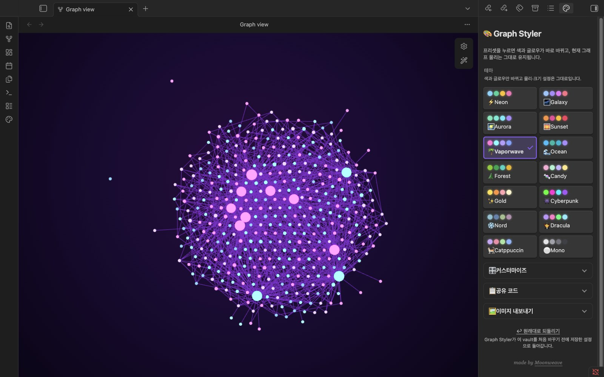
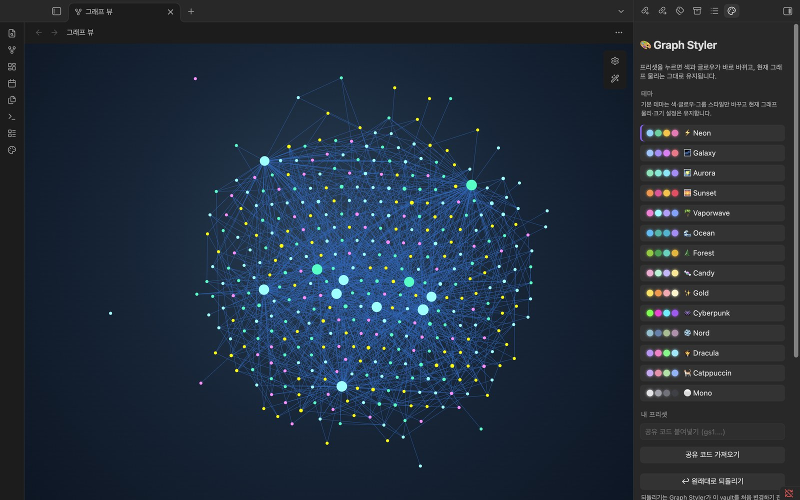
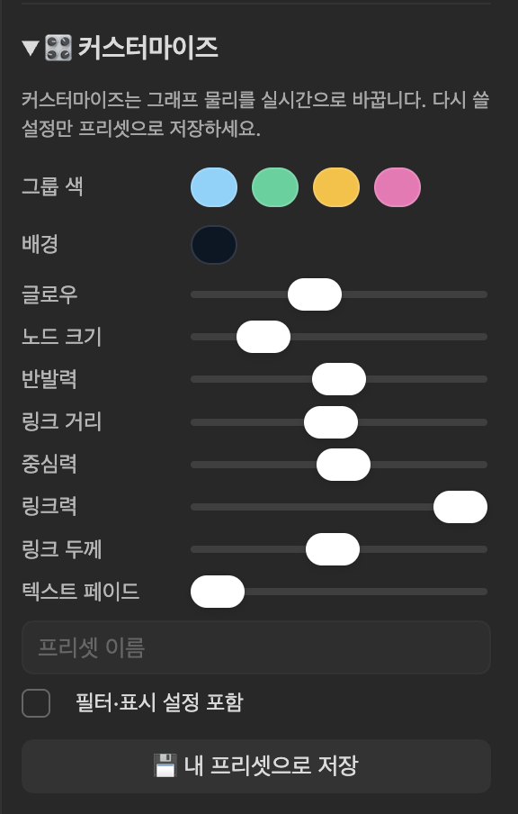
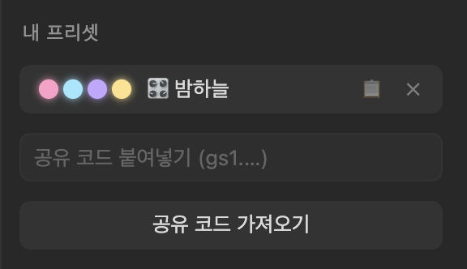
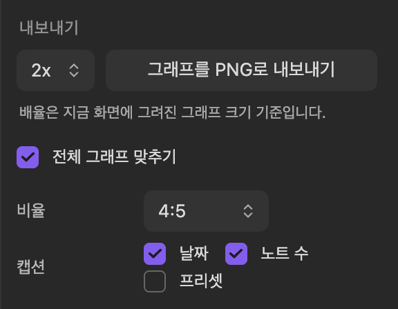
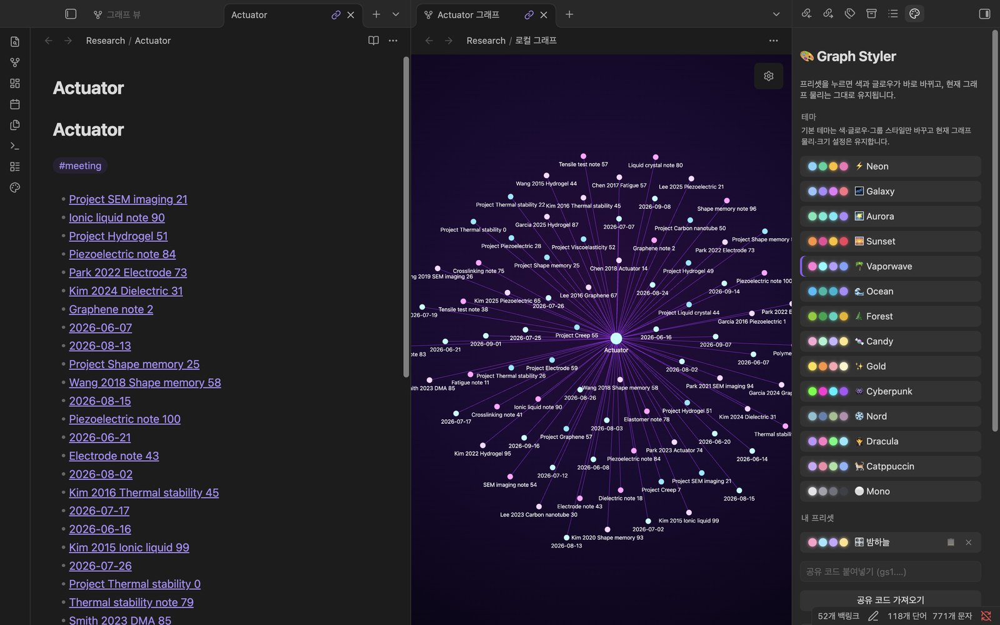
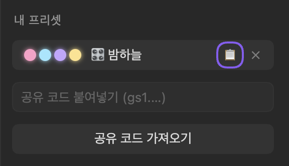
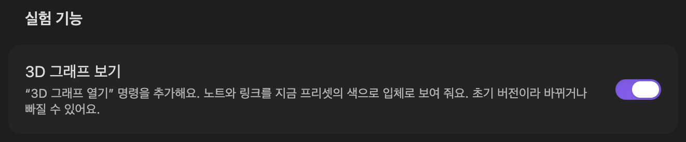
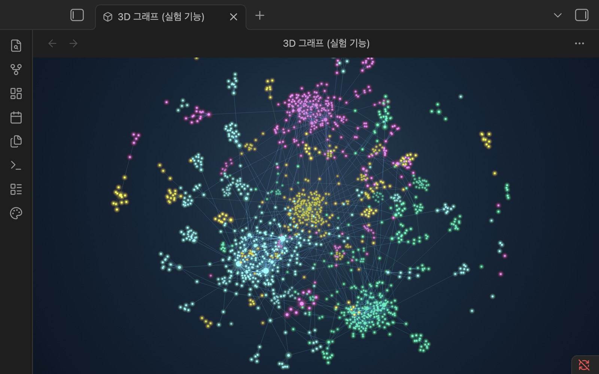

# Graph Styler

Graph Styler는 Obsidian 그래프 뷰의 색과 글로우를 프리셋 하나로 바꿔 줍니다. 기본 프리셋은 그래프 물리 설정을 건드리지 않습니다. 그래프를 SNS에 바로 올릴 수 있는 PNG로 내보낼 수도 있습니다.

<table>
  <tr>
    <td width="66%"></td>
    <td width="34%"></td>
  </tr>
</table>

만든 사람: [Moonweave](https://www.instagram.com/phd.ai.log/). [English README](README.md)

## 한눈에 보기

<!-- 좁은 화면에서 첫 열 글자가 한 자씩 꺾이지 않도록 너비를 준 HTML 표 -->
<table>
<tr><th width="24%">항목</th><th>내용</th></tr>
<tr><td>바꾸는 파일</td><td><code>.obsidian/</code> 안의 <code>graph.json</code>(색 그룹, 물리 설정은 내 프리셋을 적용할 때만), 백업 <code>graph.json.styler-bak</code>, CSS 스니펫 <code>snippets/graph-styler-&lt;프리셋&gt;.css</code>, <code>appearance.json</code>의 켜진 스니펫 목록, 플러그인 설정 <code>plugins/graph-styler/data.json</code>. vault 안에는 내보낸 PNG(다른 폴더를 고르지 않으면 <code>Graph Styler exports/</code>).</td></tr>
<tr><td>건드리지 않는 것</td><td>노트. 노트는 만들거나 고치거나 옮기거나 지우지 않습니다.</td></tr>
<tr><td>네트워크</td><td>쓰지 않습니다. 패널의 "made by Moonweave" 링크는 누를 때만 브라우저에서 열립니다.</td></tr>
<tr><td>요구 사항</td><td>Obsidian 1.4.0 이상, 데스크톱 전용</td></tr>
<tr><td>언어</td><td>한국어, 영어(Obsidian 언어 설정을 따름)</td></tr>
<tr><td>되돌리기</td><td>패널의 <strong>↩︎ 원래대로 되돌리기</strong>, 또는 플러그인 끄기(<a href="#restore">되돌리기는 무엇을 되돌리나요?</a> 참고)</td></tr>
<tr><td>라이선스</td><td>MIT</td></tr>
</table>

## 설치

Obsidian에서 **설정 → 커뮤니티 플러그인 → 탐색**을 열고 "Graph Styler"를 검색한 뒤 **설치**하고 **활성화**합니다.
직접 설치하려면 [최신 릴리스](https://github.com/moonweave/obsidian-graph-styler/releases/latest)에서 `main.js`, `manifest.json`, `styles.css`를 받아 `<vault>/.obsidian/plugins/graph-styler/`에 넣고 플러그인을 켜세요.

## 빠른 시작

1. 그래프 뷰를 엽니다.
2. 왼쪽 리본의 팔레트 아이콘(**Graph Styler**)을 누릅니다. 오른쪽에 패널이 열립니다.
3. 프리셋을 누르면 그래프가 바로 바뀝니다. 언제든 **↩︎ 원래대로 되돌리기**를 누르면 처음 모습으로 돌아갑니다.

패널 맨 위에는 프리셋이 있습니다. **🎛️ 커스터마이즈**, **📋 공유 코드**, **🖼️ 이미지 내보내기**는 그 아래에 접혀 있는 그룹이고, **↩︎ 원래대로 되돌리기**는 맨 아래에 있습니다. 그룹은 눌러서 열고 닫으며, Obsidian을 다시 시작할 때까지 그 상태가 유지됩니다.



## 할 수 있는 일

### 프리셋 적용

프리셋은 14개이고 저마다 색, 배경, 글로우가 다릅니다.

⚡ Neon · 🌌 Galaxy · 🌠 Aurora · 🌅 Sunset · 🌴 Vaporwave · 🌊 Ocean · 🌲 Forest · 🍬 Candy · ✨ Gold · 👾 Cyberpunk · ❄️ Nord · 🧛 Dracula · 🐈 Catppuccin · ⚪ Mono


프리셋은 두 칸짜리 격자로 놓여 있고, 쓰는 중인 프리셋에는 테두리와 체크 표시가 붙습니다. 기본 프리셋은 색, 글로우, 색 그룹만 바꾸고 지금의 그래프 물리·크기 설정은 그대로 둡니다. 기본 프리셋마다 명령도 하나씩 있습니다(예: **Graph Styler: 적용: Neon**).

### 내 프리셋 만들기

접혀 있는 **🎛️ 커스터마이즈**를 펼쳐 그룹 색, 배경, 글로우를 고르고 물리 슬라이더를 움직이면 그래프가 바로 따라 바뀝니다. 이름을 붙이고 **💾 내 프리셋으로 저장**을 누르면 *내 프리셋*에 추가됩니다.



커스터마이즈는 그래프 물리를 실시간으로 바꾸므로 다시 쓸 설정만 저장하세요.

### 프리셋 공유

*내 프리셋*에서 프리셋 옆의 📋를 누르면 `gs1.`로 시작하는 한 줄짜리 코드가 복사됩니다. 받은 코드는 **📋 공유 코드**를 펼쳐 **공유 코드 붙여넣기** 칸에 넣고 **공유 코드 가져오기**를 누르세요. 가져온 프리셋은 *내 프리셋*에 추가만 되고, 누르기 전까지는 적용되지 않습니다.



가져올 때 값을 검사하므로 깨지거나 손으로 고친 코드도 그래프 설정을 허용 범위 밖으로 바꾸지 못합니다. 색은 받는 사람 vault에서 노트가 많은 폴더 순서대로 입혀지므로, 같은 프리셋이라도 다른 vault에서는 다른 폴더에 색이 들어갈 수 있습니다.

### 필터·표시 설정까지 프리셋에 담기

"논문만, 태그와 화살표까지 보이게" 같은 화면을 저장하려면 그래프 뷰 설정에서 먼저 그렇게 맞춰 두고, 커스터마이즈의 **필터·표시 설정 포함**을 켠 뒤 저장하세요. *파일 검색...* 칸의 검색어와 *태그*, *첨부 파일*, *존재하는 파일만 표시*, *미연결 노트*, *화살표* 설정이 함께 저장됩니다. 프리셋을 적용하면 전체 그래프에 이 설정이 다시 적용됩니다. 노트의 로컬 그래프는 자기 필터를 그대로 씁니다.

이렇게 저장한 프리셋은 `gs2.`로 시작하는 코드로 공유됩니다. Graph Styler 0.2는 `gs2.` 코드를 "유효하지 않은 공유 코드입니다"라며 거절하고 아무것도 저장하지 않습니다. `gs1.` 코드는 0.2 이후 모든 버전에서 가져올 수 있습니다.

### 그래프를 PNG로 내보내기

명령어 팔레트에서 **Graph Styler: 그래프를 PNG로 내보내기**를 실행하거나 패널의 **🖼️ 이미지 내보내기**를 펼쳐 **그래프를 PNG로 내보내기**를 누르세요. PNG는 `Graph Styler exports/graph-<프리셋>-<날짜>.png`로 저장됩니다. 저장한 이미지는 그래프 옆에 바로 열리고 파일 탐색기에서도 표시됩니다. 알림에 경로와 **열기**·**Finder에서 보기** 버튼이 나오고, **이미지 내보내기** 그룹에는 **마지막으로 내보낸 이미지** 링크가 남습니다. 파일로 저장하지 않고 게시물이나 채팅에 바로 붙여넣으려면 **이미지 복사**를 누르세요.

패널의 옵션마다 아래에 한 줄 설명이 있습니다. 이 옵션들은 저장되는 그림에만 적용되고 그래프 자체는 바뀌지 않습니다. **비율**, 두 버튼, 마지막으로 내보낸 이미지는 그룹 안에 늘 보이고, 나머지 옵션은 처음에 닫혀 있는 **옵션 더 보기** 안에 있습니다.

- **비율**을 1:1이나 4:5로 고르면 프리셋 배경으로 여백을 채웁니다. 노트는 잘리지 않습니다.

**옵션 더 보기** 안에는 다음이 있습니다.

- **배율**(1x–4x, 기본 2x)은 지금 화면에 그려진 그래프 크기에 곱해집니다. 그래프가 보통 크기로 열려 있다면 2x로도 1080px 게시물에 충분합니다.
- **전체 그래프 맞추기**를 켜면 모든 노트가 들어오게 맞춰 내보내고 끝나면 보던 화면으로 돌려놓습니다.
- **캡션**은 날짜, 노트 수, 프리셋 이름 중 고른 것을 작은 한 줄로 넣습니다.
- **이미지 저장 폴더**에서 저장할 폴더를 정합니다(없으면 새로 만듦). 비워 두면 vault 맨 위에 저장합니다.
- 자주 내보낸다면 **내보낸 뒤 이미지 열기**를 끌 수 있습니다.



인스타그램에 올릴 거라면 **비율**을 4:5로 고르고, **옵션 더 보기**에서 **전체 그래프 맞추기**를 켜고 캡션 항목을 고른 뒤 2x로 내보내세요. 전체를 맞추느라 Obsidian이 라벨을 숨길 만큼 작아지면 연결이 가장 많은 노트의 이름을 그림에 대신 써 줍니다.


전체 그래프 맞추기, 비율, 캡션은 기본으로 꺼져 있으며 마지막으로 고른 값을 기억합니다.

### 노트의 로컬 그래프 내보내기

노트를 연 상태에서 **그래프 뷰: 로컬 그래프 열기**로 로컬 그래프를 열고, 그래프를 한 번 누른 뒤 내보내기를 실행하세요. 명령으로 내보내면 지금 보고 있는 그래프를, 패널 버튼으로 내보내면 마지막으로 누른 그래프를 내보냅니다. 파일 이름에는 노트 이름이 들어갑니다(예: `graph-vapor-Actuator-20261009-1527.png`).



### 로컬 그래프 색

로컬 그래프를 새로 열었을 때 그 그래프에 색 그룹이 없으면 지금 적용된 프리셋의 색을 받습니다. 로컬 그래프에 직접 정한 색 그룹은 그대로 둡니다.

### 키보드로 패널 쓰기

Tab을 누르면 프리셋을 차례로 지난 뒤 그룹 머리글(**커스터마이즈**, **공유 코드**, **이미지 내보내기**, 그룹이 열려 있으면 **옵션 더 보기**)로 포커스가 옮겨 갑니다. 머리글에서 Enter나 Space를 누르면 그룹이 열리고 닫힙니다. *내 프리셋*에서는 프리셋, 📋(공유 코드 복사), ✕(프리셋 삭제) 순서로 포커스가 가고, 📋나 ✕에서 Enter나 Space를 누르면 프리셋은 적용되지 않고 그 버튼만 실행됩니다. 포커스가 간 버튼과 머리글에는 테두리가 표시됩니다.



### 3D 그래프 (실험 기능)

> **실험 기능입니다.** 기본으로 꺼져 있고, 다음 버전에서 바뀌거나 빠질 수 있습니다.

**설정 → Graph Styler → 실험 기능 → 3D 그래프 보기**를 켠 뒤 명령 팔레트에서 **Graph Styler: 3D 그래프 열기**를 실행하세요. 새 탭에 노트와 링크가 입체로 나타나고, 색·배경·글로우는 지금 적용된 프리셋을 따릅니다(기본·내 프리셋 모두. 프리셋이 없으면 테마의 그래프 색).





- 드래그하면 돌아가고, 스크롤이나 핀치로 확대·축소하고, Shift+드래그나 오른쪽 드래그로 옮깁니다. 손을 떼면 몇 초 뒤 다시 천천히 돕니다.
- 노트에 마우스를 올리면 연결된 노트가 밝아지고 이름이 보입니다. 누르면 노트 탭에서 열립니다(Cmd/Ctrl+클릭은 새 탭).
- 배치는 백그라운드에서 계산하므로 자리 잡는 동안에도 Obsidian은 멈추지 않습니다. M1 Pro에서 노트 1,600개는 약 2초, 5,000개는 약 7초 걸립니다.
- 탭을 연 때의 vault를 보여 줍니다. 태그·첨부파일 노드, 필터, 검색, 로컬 그래프는 이 버전에 없습니다. 새 노트와 링크는 탭을 다시 열면 보입니다.
- 설정을 끄면 열린 3D 탭이 닫힙니다. 꺼져 있는 동안 3D 코드는 전혀 실행되지 않습니다.

## 색이 내 vault에 매핑되는 방식

Graph Styler는 Obsidian의 색 그룹을 그대로 쓰므로, 그래프 뷰 설정의 **그룹**에서 직접 보고 고칠 수 있습니다.

| vault 상태 | 만들어지는 그룹 |
|---|---|
| 노트가 든 폴더가 2개 이상 | 노트가 많은 폴더 최대 4개(`path:"폴더"`) |
| 폴더는 2개 미만이고 태그가 있음 | 많이 쓴 태그 최대 4개(`tag:#태그`) |
| 폴더 1개, 태그 없음 | 그 폴더 |
| 폴더도 태그도 없음 | 기존 그룹 유지. 배경, 글로우, 노드 색은 바뀜 |

**⚪ Mono**는 그룹을 비워 모든 노트를 같은 색으로 만듭니다. 프리셋을 적용하면 색 그룹이 바뀝니다. 처음 적용할 때 원래 `graph.json`은 백업해 둡니다.

## 자주 묻는 질문과 문제 해결

**노트를 바꾸나요?**
아니요. [한눈에 보기](#한눈에-보기)에 적은 설정 파일과 내보낸 PNG만 씁니다. 노트는 고치지 않습니다.

**네트워크로 무언가를 보내나요?**
아니요. 플러그인에는 네트워크 호출이 없습니다.

<a id="restore"></a>
**되돌리기는 무엇을 되돌리나요?**
**↩︎ 원래대로 되돌리기**는 확인을 받은 뒤, Graph Styler가 이 vault를 처음 바꾸기 전에 저장한 `graph.json`을 되살리고 Graph Styler의 CSS 스니펫을 끕니다. 그 뒤에 바꾼 그래프 설정은 덮어씁니다. 저장한 프리셋과 내보낸 PNG는 그대로 남습니다. 프리셋을 한 번도 적용하지 않았다면 "백업이 없어요"가 나옵니다.

**Graph Styler를 완전히 지우려면 어떻게 하나요?**
먼저 **↩︎ 원래대로 되돌리기**를 누른 다음 플러그인을 끄거나 삭제하세요. 플러그인을 끄면 CSS 스니펫은 꺼지지만 색 그룹은 `graph.json`에 남습니다. 스니펫 파일은 꺼진 채로 `.obsidian/snippets/`에 남아 있으니 필요 없으면 지우면 됩니다.

**프리셋을 적용했더니 그래프가 텅 비었어요.**
필터를 담은 프리셋이라면, 그 검색어에 맞는 노트가 내 vault에 없을 가능성이 큽니다. 다른 사람 vault에서 온 `path:Papers` 같은 필터가 그렇습니다. 그래프 뷰 설정(톱니바퀴 아이콘)의 **필터**에서 *파일 검색...* 칸을 비우거나 **↩︎ 원래대로 되돌리기**를 누르세요.

**로컬 그래프에 프리셋 색이 안 나와요.**
새로 연 로컬 그래프는 Graph Styler 프리셋이 켜져 있고, 그 로컬 그래프에 자기 색 그룹이 없을 때만 색을 받습니다. 그것도 한 세션에서 그 그래프를 처음 볼 때 한 번뿐입니다. 프리셋을 다시 적용하면 열려 있는 그래프가 모두 다시 칠해집니다. 로컬 그래프를 닫았다가 다시 열어도 됩니다.

**내보낸 이미지가 생각보다 작아요.**
배율은 화면에 그려진 그래프 크기에 곱해지므로, 그래프가 차지한 영역이 좁으면 이미지도 작게 나옵니다. Obsidian 창을 키우거나 그래프 영역을 넓혀 보세요. 그래픽 카드가 감당하지 못하는 배율이면 들어가는 가장 큰 배율로 저장하고 "4x는 이 그래프 화면에 너무 커서 3x로 저장"처럼 알려 줍니다.

**내보낸 그림이 어디에 저장됐나요?**
vault 안의 `Graph Styler exports` 폴더(또는 **이미지 저장 폴더**에 정한 폴더)에 있습니다. 내보내면 이미지가 그래프 옆에 바로 열리고, 파일 탐색기에서 표시되며, 알림에 **열기**·**Finder에서 보기** 버튼이 나옵니다. 나중에는 패널의 **이미지 내보내기** 그룹에 있는 **마지막으로 내보낸 이미지** 링크를 누르세요. Graph Styler 0.3.1까지는 vault 맨 위에 저장했습니다.

**플러그인을 업데이트해도 테마가 유지되나요?**
네, 0.2.0부터 유지됩니다. 플러그인을 불러올 때 지금 켜진 프리셋의 스니펫 파일이 예전 버전이 만든 것이면 새 내용으로 다시 씁니다. 직접 고친 스니펫은 건드리지 않습니다.

**밝은 테마에서도 되나요?**
네. 프리셋은 밝은 테마와 어두운 테마 모두에서 그래프 영역에 자기 배경을 칠하므로 그래프가 똑같이 보입니다. 패널은 테마를 따라갑니다.

**글로우가 번지는 빛이 아니라 색이 밝아지는 것처럼 보여요.**
글로우는 그래프가 그려지는 영역에 거는 CSS 필터(밝기, 대비, 채도)입니다. 노드와 선을 더 밝게 하고 채도를 높일 뿐, 주변에 빛 번짐을 그리지는 않습니다. 빛 번짐(bloom)은 Obsidian의 그래프 렌더러 안에서 그려야 하는데, Graph Styler는 렌더러를 바꾸지 않습니다.

**프리셋을 적용하면 그래프를 확대·축소하거나 끌어 옮기거나 노드를 누를 수 없어요.**
0.2.0–0.3.0의 버그입니다. 글로우가 걸린 층이 마우스 입력을 받는 층을 덮었습니다. 0.3.1 이상으로 업데이트하세요. 플러그인을 불러올 때 지금 켜진 프리셋이 고쳐지므로 프리셋을 다시 적용할 필요는 없습니다.

**"적용 실패"나 "PNG 내보내기 실패"가 떠요.**
개발자 콘솔(macOS는 Cmd+Opt+I, Windows·Linux는 Ctrl+Shift+I)을 열어 `[graph-styler]`로 시작하는 메시지를 확인하고 그 내용을 붙여 [이슈](https://github.com/moonweave/obsidian-graph-styler/issues)로 남겨 주세요.

## 한계와 알려진 문제

- 고해상도 내보내기는 Obsidian 그래프 렌더러의 내부 기능을 씁니다. Obsidian 업데이트로 이 부분이 바뀌면 화면 해상도로 저장하고 "고해상도 불가, 화면 해상도로 저장"이라고 알려 줍니다.
- 내보내는 동안 Obsidian이 1초쯤 멈춥니다(노트 391개 vault에서 0.3–1.2초 측정).
- 전체 그래프 맞추기로 내보낼 때 이름이 붙는 노트는 최대 8개입니다. 연결 수가 가장 많은 노트의 40% 이상인 노트만 이름이 붙습니다.
- 내보낸 이미지의 글로우는 화면과 다른 방식(캔버스)으로 그리므로, 가장 강한 프리셋(Cyberpunk 등)은 화면과 색이 조금 다르게 나옵니다.
- Obsidian이 시작할 때 복원한 로컬 그래프에 색 그룹이 비어 있으면, 예전 세션에서 일부러 비운 것이라도 프리셋 색이 들어갑니다.
- 프리셋에 담은 필터·표시 설정은 전체 그래프에만 적용됩니다.
- 처음 프리셋을 적용할 때 `graph.json`이 아직 없었다면 되돌아갈 물리 설정이 없어서, 되돌린 뒤에도 내 프리셋의 물리 설정이 남을 수 있습니다.
- 2x로 내보낸 파일은 보통 8–12MB이고 vault 안에 저장되므로 노트와 함께 동기화됩니다.
- 3D 그래프에는 WebGL 2가 필요하고, 없으면 그리지 않고 탭에 그렇다고 알려 줍니다. 탭이 보이는 동안에는 계속 돌면서 초당 60번 다시 그리며, M1 Pro에서 CPU 코어 하나의 약 30%를 썼습니다(노트 1,600–5,000개). 가려진 탭은 그리지 않습니다.

## AI 어시스턴트를 위한 정보

- 플러그인 id: `graph-styler`. 데스크톱 전용, `minAppVersion` 1.4.0.
- 명령: `graph-styler:open-graph-styler`, `graph-styler:export-graph-png`, `graph-styler:open-3d-graph`(`experimental3d`가 켜져 있을 때만 보임), 그리고 프리셋 id별 `graph-styler:apply-<id>`(`neon`, `galaxy`, `aurora`, `sunset`, `vapor`, `ocean`, `forest`, `candy`, `gold`, `cyber`, `nord`, `dracula`, `catppuccin`, `mono`).
- 쓰는 파일: `.obsidian/graph.json`, `.obsidian/graph.json.styler-bak`(처음 바꾸기 전 백업, 덮어쓰지 않음), `.obsidian/snippets/graph-styler-<id>.css`, `.obsidian/appearance.json`(켜진 스니펫), `.obsidian/plugins/graph-styler/data.json`, 내보내기 폴더(`exportFolder`, 기본 `Graph Styler exports`, 비우면 vault 맨 위)의 `graph-<프리셋>[-<노트>]-<YYYYMMDD-HHmm>[-<n>].png`. 노트는 쓰지 않습니다.
- 설정(`data.json`): `custom`(저장한 프리셋), `exportFolder`, `openAfterExport`, `lastExport`(마지막으로 저장한 이미지 경로), `exportScale`(1–4), `exportOptions`(`fit`, `aspect`: `original` \| `1:1` \| `4:5`, `caption`: `date`, `notes`, `preset`), `experimental3d`(3D 그래프 켜기, 기본 꺼짐), `resumeSnippet`(내부용).
- 공유 코드: `gs1.` + base64url(JSON `{v:1, label, colors[4], bg, glow, forces}`). `forces`에는 `node`, `repel`, `dist`, `center`, `linkS`, `line`, `fade`가 들어갑니다. `gs2.`는 `v:2`이고 `search`, `showTags`, `showAttachments`, `hideUnresolved`, `showOrphans`, `showArrow`를 담은 `view`가 추가됩니다. 코드에는 id가 없으며 가져올 때 값을 허용 범위 안으로 맞춥니다.
- 네트워크: 쓰지 않음.

## 개발과 기여

빌드 과정이 없는 CommonJS 파일 하나로 된 플러그인입니다. 릴리스 파일은 `main.js`, `manifest.json`, `styles.css`입니다.

```sh
# 단위 테스트(통과하면 출력 없음)
node test/graph-styler.test.js
node test/graph3d.test.js
# 프리셋이 물리 설정을 지키는지
node scripts/check-physics-contract.js
# vault에 플러그인 복사
./deploy.sh /path/to/your/vault
# 실행 중인 Obsidian에 실제 입력 보내기(스크립트 맨 위 참고)
node scripts/input-smoke.js --port 9222 --vault <vault> --preset aurora
```

그래프 영역의 CSS·DOM·렌더러를 건드리는 변경은 `--remote-debugging-port`로 따로 띄운 Obsidian에서 전체 그래프와 로컬 그래프(`--leaf localgraph`) 모두 `scripts/input-smoke.js`를 통과해야 준비된 것으로 봅니다(사용법은 파일 맨 위에 있습니다). 스크린샷이 멀쩡해 보이는 것만으로는 부족합니다. 그래프에 실제 마우스·트랙패드 입력을 보내, 확대·이동·마우스 올리기·노드 끌기·오른쪽 클릭·클릭 중 하나라도 안 되면 실패합니다.

`deploy.sh`에는 항상 vault 경로를 넘기세요. 경로를 빼면 관리자 본인의 vault 경로가 쓰입니다. 저장소에 CI가 없으니 풀 리퀘스트를 열기 전에 두 검사를 직접 돌려 주세요. UI 문구는 `main.js` 맨 위의 `en`·`ko` 표에 있으므로 문구를 추가할 때는 두 언어를 모두 넣어 주세요. 이슈와 풀 리퀘스트는 [GitHub](https://github.com/moonweave/obsidian-graph-styler)에서 받습니다.

## 라이선스

MIT © 2026 Moonweave. [LICENSE](LICENSE)를 참고하세요.
