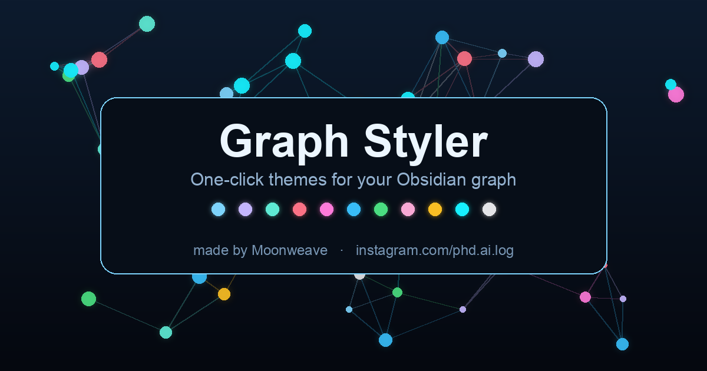

# 🎨 Graph Styler

One-click aesthetic themes for the Obsidian graph view. Pick a vibe — **color, glow, and forces** are applied instantly. No CSS, no JSON, no setup.

Made by **[Moonweave](https://www.instagram.com/phd.ai.log/)**.

<!-- Replace docs/preview.png with a real graph screenshot anytime. -->

## Why
Obsidian's graph looks amazing in screenshots — but getting there means digging through color groups, force sliders, and CSS snippets. Graph Styler turns that into a single click. Think *Canva templates, but for your graph*.

## Presets
⚡ Neon · 🌌 Galaxy · 🌠 Aurora · 🌅 Sunset · 🌴 Vaporwave · 🌊 Ocean · 🌲 Forest · 🍬 Candy · ✨ Gold · 👾 Cyberpunk · ⚪ Mono

Each preset applies node/group colors, a glow CSS snippet, and force/size values tuned to the mood.

## Usage
1. Open the graph view (global graph).
2. Click the 🎨 **palette** icon in the left ribbon → a panel opens on the right.
3. Click any preset. Your graph changes instantly.
4. Tweak freely afterward, or hit **↩︎ Restore** to revert — your original `graph.json` is backed up automatically.

## Install
**Via BRAT (now):**
1. Install the *BRAT* community plugin.
2. BRAT → "Add beta plugin" → `moonweave/obsidian-graph-styler`.
3. Enable **Graph Styler** under Community plugins.

**Manual:** copy `main.js` + `manifest.json` into `<vault>/.obsidian/plugins/graph-styler/`, then enable.

*(Community store submission planned.)*

## Notes
- **Works in any vault.** Group colors auto-map to the busiest folders in *your* vault — no setup, no hardcoded paths.
- **Bilingual UI.** The panel follows Obsidian's language — English or 한국어.
- Writes the global graph config (`.obsidian/graph.json`) and a CSS snippet (`.obsidian/snippets/graph-styler-*.css`); your original `graph.json` is backed up first.
- Desktop only.

## License
MIT © 2026 Moonweave. Free to use and modify — please keep the attribution.

🇰🇷 [한국어 설명](README.ko.md)
