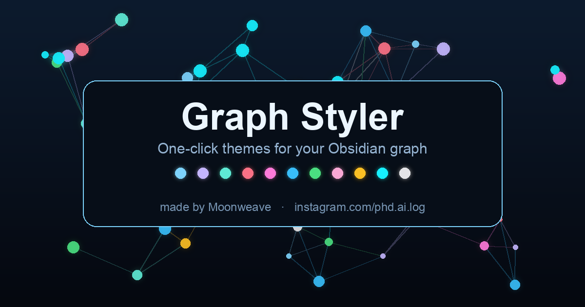
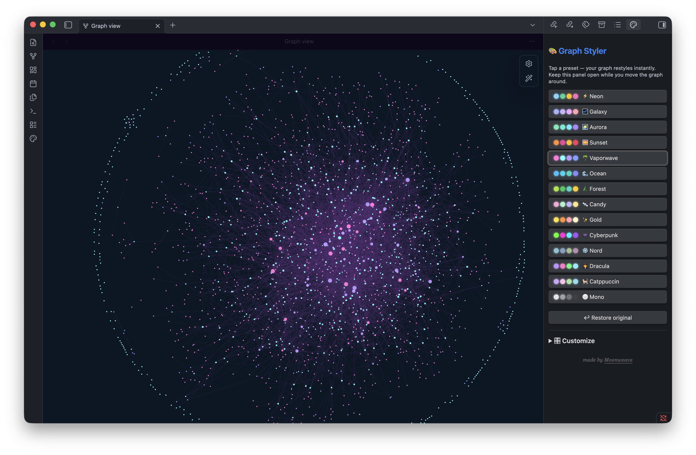
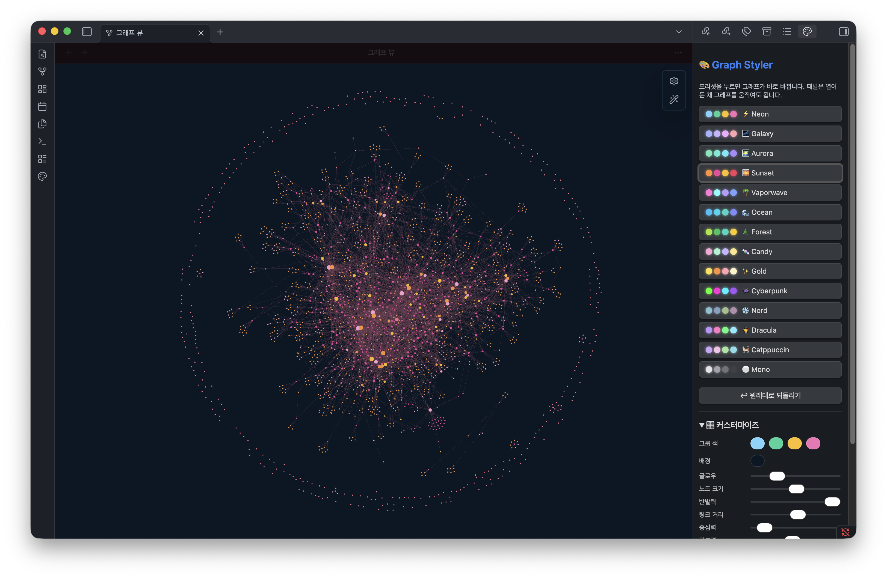
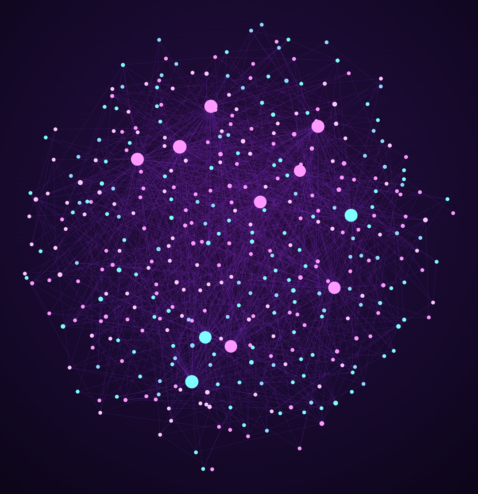

# 🎨 Graph Styler

One-click aesthetic themes for the Obsidian graph view. Pick a vibe — **color and glow** are applied instantly while your current graph physics stays unchanged. No manual CSS, JSON, or setup.

Made by **[Moonweave](https://www.instagram.com/phd.ai.log/)**.

<em>Same vault, one click apart — Vaporwave &amp; Sunset:</em>

<table>
  <tr>
    <td width="50%"></td>
    <td width="50%"></td>
  </tr>
</table>

## Why
Obsidian's graph looks amazing in screenshots — but getting there means digging through color groups, force sliders, and CSS snippets. Graph Styler turns that into a single click. Think *Canva templates, but for your graph*.

## Presets
⚡ Neon · 🌌 Galaxy · 🌠 Aurora · 🌅 Sunset · 🌴 Vaporwave · 🌊 Ocean · 🌲 Forest · 🍬 Candy · ✨ Gold · 👾 Cyberpunk · ❄️ Nord · 🧛 Dracula · 🐈 Catppuccin · ⚪ Mono

Each built-in preset applies node/group colors and a glow CSS snippet while preserving your current force and visual size settings. Custom presets can explicitly save force/size values.

**Make your own.** Open **🎛️ Customize** in the panel — drag the force/size sliders (repel, link distance, node size…) and pick colors, watch the graph update live, then **💾 Save as preset**. Customization changes graph physics; save it only when you want a reusable custom preset. Your presets show up under *My presets* and persist.

**Share a preset.** Click 📋 on one of *My presets* to copy a one-line share code (it starts with `gs1.`) and send it to anyone. To use a code you received, paste it into the box under *My presets* and click **Import share code**. The preset is added to *My presets* without being applied; click it when you want it. Colors and values are checked on import, so a damaged or hand-edited code can't push the graph out of range.

## How colors map to your vault
Graph Styler hardcodes nothing — it adapts to *your* vault:

- It finds your most-used **folders** and assigns the preset's palette to them (up to 4).
- No folders? It falls back to your most-used **tags**.
- Totally flat (no folders or tags)? You still get the glow, background, and node colors — just no per-group split.

It writes these into Obsidian's **native graph color groups** (Settings → Graph → Groups), so you can see and tweak them there. Whether you have 2 groups or 4, it just works — and the glow, background, and node styling are identical for everyone. Applying a preset replaces your current color groups; your original config is backed up, so **Restore** brings it back. Restore returns to the snapshot saved before Graph Styler first changed the vault and may overwrite graph settings changed afterward.

## Usage
1. Open the graph view (global graph).
2. Click the 🎨 **palette** icon in the left ribbon → a panel opens on the right.
3. Click any preset. Your graph changes instantly.
4. Tweak freely afterward, or hit **↩︎ Restore** to revert — your original `graph.json` is backed up automatically.

**Export as PNG.** Run **Export graph as PNG** from the command palette, or pick a scale (1x–4x, default 3x) under *Export* in the panel. The graph is redrawn once at that multiple of its on-screen resolution — labels stay sharp instead of being upscaled — and saved to the vault root as `graph-<preset>-<date>.png` with the current preset background and glow. It captures what the graph view currently shows (same pan and zoom). If the chosen scale is too large for the graph view's size, it saves at the largest scale that fits and tells you. This relies on Obsidian's internal graph renderer; if a future Obsidian version changes it, the export falls back to screen resolution and says so.

 A Vaporwave export of a 391-note sample vault (2x, resized to 1080px wide).

## Install
**Community plugins (recommended):**
1. In Obsidian, open Settings -> Community plugins -> Browse.
2. Search for `Graph Styler`.
3. Install it, then enable **Graph Styler** under Community plugins.

Direct listing: <https://obsidian.md/plugins?id=graph-styler>

**Development builds:** install with BRAT from `moonweave/obsidian-graph-styler`, or copy `main.js` + `manifest.json` + `styles.css` into `<vault>/.obsidian/plugins/graph-styler/`, then enable.

## Notes
- **Works in any vault.** Group colors auto-map to the busiest folders in *your* vault — no setup, no hardcoded paths.
- **Bilingual UI.** The panel follows Obsidian's language — English or 한국어.
- Writes the global graph config (`.obsidian/graph.json`) and a CSS snippet (`.obsidian/snippets/graph-styler-*.css`); your original `graph.json` is backed up first. Restore requires confirmation because it restores that first snapshot.
- Themes look the same in light and dark mode — the graph pane takes on the theme's own background.
- Desktop only.

## License
MIT © 2026 Moonweave. Free to use and modify — please keep the attribution.

🇰🇷 [한국어 설명](README.ko.md)
