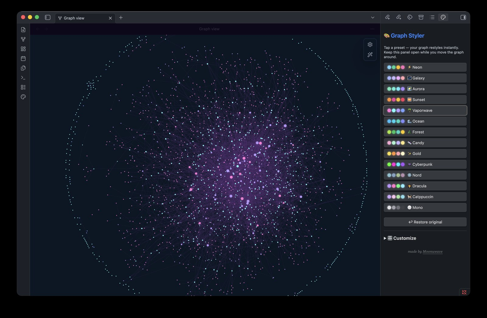
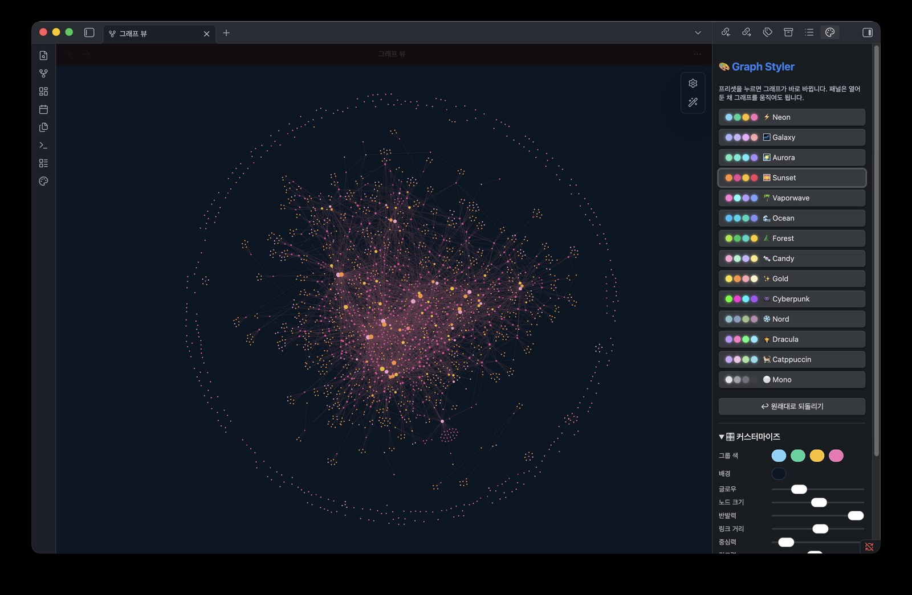

# Graph Styler

Graph Styler restyles the Obsidian graph view in one click. Its built-in colour and glow presets leave your graph physics alone. It can also export the graph as a PNG ready to post.

<table>
  <tr>
    <td width="50%"></td>
    <td width="50%"></td>
  </tr>
</table>

Made by [Moonweave](https://www.instagram.com/phd.ai.log/). [한국어 README](README.ko.md)

## At a glance

| Item | Details |
|---|---|
| What it changes | In `.obsidian/`: `graph.json` (colour groups; physics only for your own presets), a backup `graph.json.styler-bak`, CSS snippets `snippets/graph-styler-<preset>.css`, the enabled-snippet list in `appearance.json`, and its settings in `plugins/graph-styler/data.json`. In the vault root: the PNGs you export. |
| What it never touches | Your notes. It does not create, edit, move or delete them. |
| Network | None. The only link is "made by Moonweave" in the panel, which opens in your browser if you click it. |
| Requirements | Obsidian 1.4.0 or later, desktop only |
| Languages | English and Korean; the panel follows Obsidian's language |
| Undo | **↩︎ Restore original** in the panel, or disable the plugin (see [What does Restore restore?](#restore)) |
| License | MIT |

## Install

In Obsidian, open **Settings → Community plugins → Browse**, search for "Graph Styler", then select **Install** and **Enable**.
To install by hand, download `main.js`, `manifest.json` and `styles.css` from the [latest release](https://github.com/moonweave/obsidian-graph-styler/releases/latest) into `<vault>/.obsidian/plugins/graph-styler/` and enable the plugin.

## Quick start

1. Open the graph view.
2. Select the palette icon (**Graph Styler**) in the left ribbon. The panel opens on the right.
3. Select a preset. The graph changes at once; **↩︎ Restore original** at any time brings back what you had.


## What you can do

### Apply a preset

Fourteen presets, each with its own colours, background and glow:

⚡ Neon · 🌌 Galaxy · 🌠 Aurora · 🌅 Sunset · 🌴 Vaporwave · 🌊 Ocean · 🌲 Forest · 🍬 Candy · ✨ Gold · 👾 Cyberpunk · ❄️ Nord · 🧛 Dracula · 🐈 Catppuccin · ⚪ Mono


Presets change colours, glow and colour groups only. Your forces and size settings stay as they are. Each built-in preset is also a command: **Graph Styler: Apply: Neon** and so on.

### Make your own preset

Open **🎛️ Customize**, pick group colours, a background and the glow, and move the physics sliders. The graph follows as you drag. Name it and select **💾 Save as preset**; it appears under *My presets*.


Customize changes the graph's physics live, so save only what you want to reuse.

### Share a preset

To send a preset to someone, select 📋 next to it under *My presets*. A one-line code starting with `gs1.` is copied. To use a code you received, paste it into **Paste a share code** and select **Import share code**. The preset is added to *My presets* but not applied until you select it.


Imported values are checked, so a damaged or edited code cannot push the graph out of range. Colours go to the recipient's own busiest folders, so the same preset can colour different folders in another vault.

### Keep filters and display in a preset

To save a view such as "only papers, with tags and arrows", set it up in the graph's own settings, tick **Include filters and display** in Customize, then save. The preset keeps the *Search files...* query and the *Tags*, *Attachments*, *Existing files only*, *Orphans* and *Arrows* toggles. Applying it sets them again on the global graph; a note's local graph keeps its own filters.

Presets saved this way share as codes starting with `gs2.`. Graph Styler 0.2 rejects `gs2.` codes with "That share code is not valid" and saves nothing; `gs1.` codes work in 0.2 and later.

### Export your graph as a PNG

Run **Graph Styler: Export graph as PNG** from the command palette, or use **Export graph as PNG** in the panel. The PNG is saved in the vault root as `graph-<preset>-<date>.png`, and a notice tells you the name and size.

- **Scale** (1x–4x, default 2x) multiplies the graph as it is drawn on your screen. 2x of a typical pane is wide enough for a 1080 px post.
- **Fit whole graph** frames every note for the export, then puts your view back.
- **Aspect** 1:1 or 4:5 pads the image with the preset background. Notes are never cropped.
- **Caption** adds a small line with the date, the note count or the preset name.


To post on Instagram, tick **Fit whole graph**, choose **4:5**, pick the caption items and export at 2x. When the fitted view is too far out for Obsidian to show labels, the most-linked notes are named in the image.


All export options are off by default, and your last choices are remembered.

### Export a note's local graph

With a note open, run **Graph view: Open local graph**, select the local graph, and run the export. Graph Styler exports the graph you are in; from the panel button, it uses the graph you selected last. The file name includes the note, for example `graph-vapor-Actuator-20261009-1527.png`.


### Local graph colours

A local graph that opens without colour groups of its own takes the active preset's colours. Colour groups you set on a local graph yourself are left alone.

### Use the panel from the keyboard

In *My presets*, Tab moves from a preset to its 📋 (copy share code) and ✕ (delete) buttons, and Enter or Space runs them without applying the preset. These buttons show a focus ring.


## How colours map to your vault

Graph Styler writes Obsidian's own colour groups, so you can see and edit them under **Groups** in the graph view's settings.

| Your vault | Groups |
|---|---|
| Two or more folders with notes | Up to four folders with the most notes, as `path:"Folder"` |
| Fewer than two folders, but tags | Up to four most-used tags, as `tag:#tag` |
| One folder, no tags | That folder |
| No folders, no tags | Your existing groups are kept; background, glow and node colours still change |

**⚪ Mono** clears the groups so every note has the same colour. Applying a preset replaces your colour groups; the original `graph.json` is backed up the first time.

## FAQ and troubleshooting

**Does it change my notes?**
No. It writes the configuration files listed in [At a glance](#at-a-glance) and the PNGs you export. Notes are never edited.

**Does it send anything over the network?**
No. There are no network calls in the plugin.

<a id="restore"></a>
**What does Restore restore?**
**↩︎ Restore original** asks for confirmation, then writes back the `graph.json` saved before Graph Styler first changed this vault and turns off its CSS snippets. Graph settings you changed after that are overwritten. Your saved presets and exported PNGs stay. If you never applied a preset, it shows "No backup found".

**How do I remove Graph Styler completely?**
Select **↩︎ Restore original** first, then disable or uninstall the plugin. Disabling turns off the CSS snippet but leaves the colour groups in `graph.json`. The snippet files stay in `.obsidian/snippets/` (turned off) until you delete them.

**The graph is empty after I applied a preset.**
The preset probably includes filters, and its search query matches none of your notes, for example a `path:Papers` filter from someone else's vault. Open the graph view's settings (the gear icon), clear the *Search files...* box under **Filters**, or select **↩︎ Restore original**.

**A local graph doesn't show the preset's colours.**
New local graphs take the colours only while a Graph Styler preset is active, only if they have no colour groups of their own, and only once per session. Apply a preset again to recolour every open graph, or close the local graph and open it again.

**The exported image is smaller than I expected.**
The scale multiplies the graph as drawn on screen, so a narrow pane gives a narrow image; widen the pane or the window. If a scale is too large for the graphics card, Graph Styler saves at the largest scale that fits and says so ("4x is too large for this graph view — saved at 3x").

**Does my theme survive a plugin update?**
Yes, from 0.2.0 on. When the plugin loads, the active preset's snippet file is rewritten if an older version generated it; snippets you edited by hand are left alone.

**Does it work with a light theme?**
Yes. Presets paint their own background in the graph pane in light and dark themes alike, so the graph looks the same in both. The panel follows your theme.

**Why does the glow look like brighter colours rather than a bloom?**
The glow is a CSS filter (brightness, contrast and saturation) on the layer that draws the graph. It makes nodes and lines brighter and more saturated; it does not draw a halo around them. A bloom would have to be drawn inside Obsidian's graph renderer, which Graph Styler does not change.

**I see "Apply failed" or "PNG export failed".**
Open the developer console (Cmd+Opt+I on macOS, Ctrl+Shift+I on Windows and Linux) and look for messages starting with `[graph-styler]`, then [open an issue](https://github.com/moonweave/obsidian-graph-styler/issues) with them.

## Limits and known issues

- High-resolution export uses internal parts of Obsidian's graph renderer. If an Obsidian update changes them, the export falls back to screen resolution and says "High-resolution export unavailable — saved at screen resolution".
- Obsidian pauses for about a second while exporting (0.3–1.2 s measured on a 391-note vault).
- In a fitted export, at most 8 notes are labelled, and only notes with at least 40 % of the links of the most-linked note.
- The glow in an export is drawn by the canvas, not by the screen's compositor, so the strongest presets (such as Cyberpunk) come out in slightly different colours than on screen.
- A local graph that Obsidian restores at startup with empty colour groups gets the preset's colours, even if you emptied them in an earlier session.
- Filters and display from a preset apply to the global graph only.
- If `graph.json` did not exist yet when you first applied a preset, Restore has nothing to return physics to: settings from your own presets can remain afterwards.
- Exports at 2x are often 8–12 MB and land in the vault root, so they are synced along with your notes.

## For AI assistants

- Plugin id: `graph-styler`. Desktop only, `minAppVersion` 1.4.0.
- Commands: `graph-styler:open-graph-styler`, `graph-styler:export-graph-png`, and `graph-styler:apply-<id>` for the preset ids `neon`, `galaxy`, `aurora`, `sunset`, `vapor`, `ocean`, `forest`, `candy`, `gold`, `cyber`, `nord`, `dracula`, `catppuccin`, `mono`.
- Files written: `.obsidian/graph.json`, `.obsidian/graph.json.styler-bak` (first-change backup, never overwritten), `.obsidian/snippets/graph-styler-<id>.css`, `.obsidian/appearance.json` (enabled snippets), `.obsidian/plugins/graph-styler/data.json`, and exported `graph-<preset>[-<note>]-<YYYYMMDD-HHmm>[-<n>].png` in the vault root. Notes are never written.
- Settings (`data.json`): `custom` (saved presets), `exportScale` (1–4), `exportOptions` (`fit`, `aspect`: `original` \| `1:1` \| `4:5`, `caption`: `date`, `notes`, `preset`), `resumeSnippet` (internal).
- Share codes: `gs1.` + base64url(JSON `{v:1, label, colors[4], bg, glow, forces}`), where `forces` holds `node`, `repel`, `dist`, `center`, `linkS`, `line`, `fade`. `gs2.` is the same with `v:2` and a `view` object holding `search`, `showTags`, `showAttachments`, `hideUnresolved`, `showOrphans`, `showArrow`. Codes never contain an id; values are clamped on import.
- Network: none.

## Development and contributing

The plugin is a single CommonJS file with no build step: `main.js`, `manifest.json` and `styles.css` are the release assets.

```sh
# Unit tests (silent on success)
node test/graph-styler.test.js
# Presets keep graph physics
node scripts/check-physics-contract.js
# Copy the plugin into a vault
./deploy.sh /path/to/your/vault
```

Always pass a vault path to `deploy.sh`; without one it uses the maintainer's own vault. The repository has no CI, so run both checks locally before opening a pull request. UI text lives in the `en` and `ko` tables at the top of `main.js`; add both when you add a string. Issues and pull requests are welcome on [GitHub](https://github.com/moonweave/obsidian-graph-styler).

## License

MIT © 2026 Moonweave. See [LICENSE](LICENSE).
